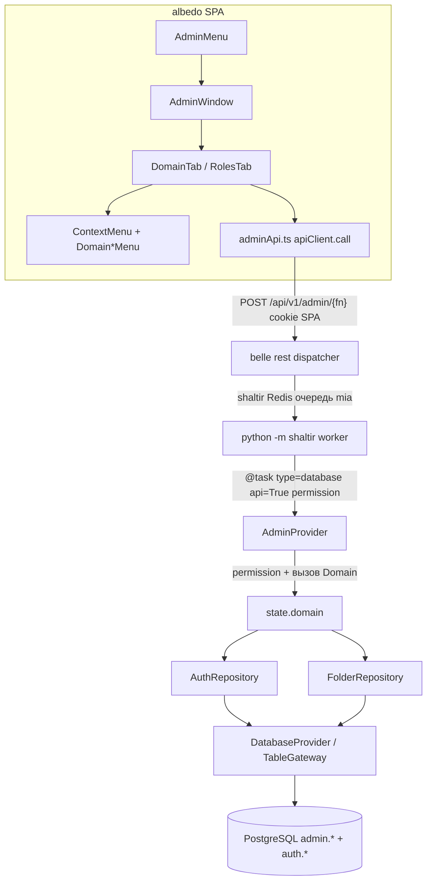
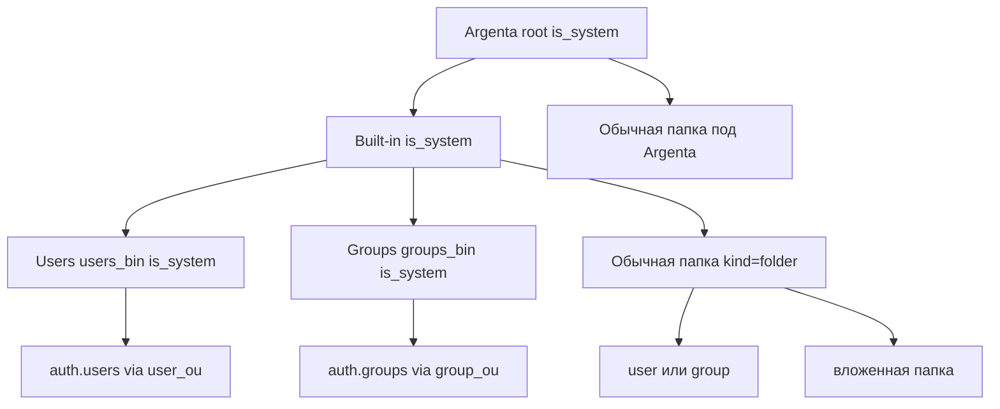
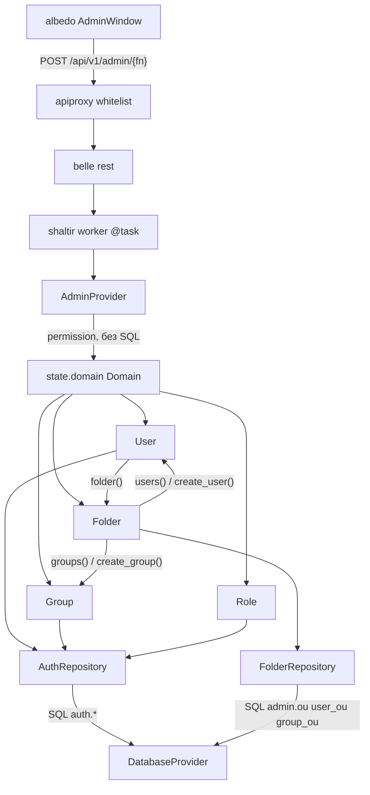

# План: mia-admin (бэкенд) + Admin Panel (albedo)

| Поле | Значение |
|------|----------|
| **Тип** | архитектура + фича |
| **Сложность** | высокая |
| **Статус** | ADR-001 + ADR-002 accepted (Эна, 2026-08-29). Код — по фазам плана |
| **Рабочий файл** | `/home/opencode/projects/mia/plan-mia-admin.md` |
| **Не путать с** | `/home/opencode/projects/albedo/plan-admin.md` (LLM / homes / MCP — другой план) |
| **Стандарт** | `/home/opencode/projects/docs/CODING_STANDARD.md` (§3 ООП, Repository, инкапсуляция) |
| **Комментарии** | русский; код — английский |
| **ADR** | §5 ADR-001 accepted (схема/транспорт/маска). §13 ADR-002 accepted (объектная модель Domain на State). Открытые вопросы закрыты приказом Мастера |

**Репозитории:** новый `mia-admin` (`modules/admin`) + правки `mia-auth` (колонка маски) + `albedo` (окно, вкладки, ПКМ) + `belle` compose (`MIA_WORKER_MODULES`).

**Цепочка после утверждения:**

```
Эна — ADR (схема admin.*, маска, меню-классы)
  → Нора — DDL + seed OU + ALTER auth.roles.capability_mask
    → Сона — ModuleBase + RPC @task + фронт features/admin + ContextMenu
      → Лита — permission на каждый api=True; не username=admin
        → Катерина — тесты пирамиды (OU цикл, маска↔permissions, RPC 403)
          → Рэй — MIA_WORKER_MODULES += admin; git init mia-admin
```

Код только по шагам плана. Keycloak / SSO / Kerberos **не трогать**.

---

## 1. Цель

Админ-поверхность Domain + Roles в albedo: дерево организации (OU), привязка существующих людей/групп к папкам, роли через битовую маску, синхронизированную со строковыми `auth.permissions`.

1. Хедер albedo: пункт **Admin Panel** (как `WorkspaceMenu`) → окно `Window` (как `AiWindows`).
2. Вкладки (как `UserSettingsModal`, `nav nav-tabs`): **Domain** (первая), **Roles**.
3. Domain: дерево Argenta → Built-in → Users / Groups; вложенные папки любой глубины; таблица людей с OU и именем per-user БД.
4. Roles: CRUD маски провайдеров / пользователей / групп; enforcement остаётся на `auth.role_permissions`.
5. ПКМ: классы меню на сущность; на левой панели workspace — тоже, kebab не ломать.
6. Всё изменение БД — воркеры `@task(type="database", api=True, permission=...)`.

---

## 2. Инварианты

1. **Людей не дублировать.** Источник пользователей — `auth.users`. Группы — `auth.groups`. Роли/права — `auth.roles` / `auth.permissions` / `auth.user_roles` / `auth.group_roles` / `auth.role_permissions`. Новой таблицы «людей» нет.
2. **Админ-RPC проверяют permission, не `username=admin`.** Тот же инвариант, что в `albedo/plan-admin.md`.
3. **Транспорт SPA:** `POST /api/v1/{module}/{function}`, HttpOnly cookies, заголовок `X-Albedo-Client: spa`. Клиент: `apiClient.call(module, fn, kwargs)`. Не REST CRUD `/admin/users`.
4. **SQL только в воркере.** `@task(type="database")`. Доступ к таблицам — `DatabaseProvider` / `state.db` (TableGateway). Из процесса belle REST прямой SQL запрещён.
5. **Создание пользователя не создаёт БД.** `admin.create_user_in_ou` вызывает `auth.create_user`, пишет `admin.user_ou`, считает `workspace_db` через `modules.workspace.schemas.user_dbname`. `CREATE DATABASE` — зона `workspace` при первом заходе.
6. **Имя per-user БД:** `belle_workspace_{uuid_hex}` (`user_dbname`). Колонка `workspace_db VARCHAR(63) NOT NULL` — денормализация имени, не провижининг.
7. **Enforcement прав — строковые permissions.** `capability_mask` — денормализация для UI/фильтра. Источник истины: `role_permissions`.
8. **`llm:provider_manage` уже есть** в `modules/llm/schema.py`. Не выдумывать вторую систему прав на провайдеров. Если не хватит гранулярности — расширять `LLM_SCHEMA`, не admin.
9. **Builtin OU:** Argenta и Built-in нельзя удалить и переименовать. Users / Groups нельзя удалить, наполнять можно.
10. **Новые пользователи** по умолчанию в Built-in/Users, **группы** — в Built-in/Groups.
11. **Модуль — отдельный git-репо** в `modules/admin`, как `mia-workspace` / `mia-llm`. Remote имя `mia-admin`, URL `https://github.com/Dek1m/mia-admin.git`. **Не пушить и не создавать GitHub-репо без явной команды Мастера.**
12. **ПКМ в albedo сейчас нет** (`onContextMenu` отсутствует). Kebab левой панели остаётся.

---

## 3. Вне скоупа

- Keycloak / SSO / Kerberos.
- REST CRUD `/admin/*`.
- Дубль `auth.users` / отдельный каталог людей.
- SQL из belle REST.
- Создание per-user PostgreSQL из admin.
- План `albedo/plan-admin.md` (LLM providers, homes, MCP, health воркера).
- Drag-and-drop дерева, перемещение пользователя между OU (можно фаза 7+, не эта волна).
- Удаление пользователей/групп из Domain (есть `users:delete` / `groups:delete` в auth; UI удаления в этой волне не делаем, только rename + create).
- Гейт пункта меню по списку permissions в `get_me` (albedo permissions на клиент не отдаёт). Пункт виден залогиненным; RPC режет 403 + toast. Гейт UI — не эта волна (ADR 5.1.5).

---

## 4. Контекст из кода и памяти

| Факт | Где |
|------|-----|
| `AUTH_CORE_SCHEMA`: `users:*`, `groups:*`, `roles:*`, роли `system_admin` / `user_manager` / `group_manager` / `role_manager` | `mia/modules/auth/schema.py` |
| `auth.users` / `groups` / `roles` / `permissions` / memberships | `mia/modules/auth/schemas.py` |
| `user_dbname(user_id)` → `belle_workspace_{uuid_hex}` | `mia/modules/workspace/schemas.py` |
| Шаблон модуля: `ModuleBase`, `@task`, `DB_SCHEMA`, `AUTH_SCHEMA`, `ddl/`, `hash.json`, `tests/`, `.gitignore` | `modules/llm`, `modules/workspace` |
| `hash.json` | `python scripts/generate_hash.py admin` |
| Worker default / compose | `core/dispatch/tasks.py` (`db,auth,workspace`); `belle/docker-compose.yml` сейчас `db,auth,workspace,llm` |
| SPA клиент | `albedo/src/api/client.ts` → `POST /api/v1/{module}/{fn}` |
| Меню хедера | `WorkspaceMenu.tsx`, `AiMenu.tsx` в `AppShell.tsx` |
| Окно | `shared/ui/Window.tsx`, `AiWindows.tsx` |
| Вкладки | `UserSettingsModal.tsx` (`nav nav-tabs`) |
| Левая панель | `WorkspaceSidebar` + `HomeTree` + `WorkspaceDiskTree`; kebab в sidebar |
| `create_user` / `create_group` в auth | `@task(type="database")` **без** `api=True` — admin оборачивает |
| `llm:provider_manage` | уже в `LLM_SCHEMA` |
| Риск памяти | `system_admin` в БД мог остаться без `*:*` — не чинить в этой волне, но RPC не завязывать на username |

---

## 5. ADR-001 mia-admin + Admin Panel — **accepted**

**Тип:** Hexagonal (модуль mia) + Clean (albedo features)  
**Статус:** accepted, 2026-08-29, Эна  
**Стандарт:** `docs/CODING_STANDARD.md` §3 ООП, Repository  
**Контекст:** ADR-002 v4 (belle `Application()` → shaltir Redis → `python -m shaltir worker`); schema-first как `modules/llm`, `modules/workspace`, `modules/auth/schemas.py`; инвариант «людей не дублировать». Не путать с `albedo/plan-admin.md` (LLM/homes/MCP — вне скоупа).

Открытые вопросы закрыты приказом Мастера. Сона/Нора не сужают и не расширяют.

### 5.1. Зафиксированные решения

1. **Схема `admin`, не раздувать `auth`.** Люди = `auth.users`, группы = `auth.groups`. Новой таблицы людей нет. `admin.ou` / `admin.user_ou` / `admin.group_ou` — только дерево и привязки. FK на `auth.users(id)` / `auth.groups(id)`.
2. **Создание user/group:** в `Users` / `Groups` **и** в любой обычной папке (`kind=folder`, не `is_system`). Argenta и Built-in — нельзя. RMB **Tasks** на папке (`DomainFolderMenu`). Default без `ou_id`: Users / Groups.
3. **12 бит маски** (`Capability` IntFlag в `mask.py`): providers/users/groups × CRUD. Providers **C/U/D** → `llm:provider_manage`; **R** → `llm:config`. Users/groups: C/R/U/D → `users:*` / `groups:*` (`R` = `read`+`list`). Не схлопывать providers в 1 бит.
4. **Delete OU в UI этой волны нет.** RPC `delete_ou` есть (тесты, фаза 7+). Меню папки: New folder, Tasks, Rename.
5. **Пункт меню Admin Panel виден всем залогиненным.** Гейт по permissions в `get_me` — не эта волна. Enforcement: 403 на RPC + toast. Не `username=admin`.
6. **`system_admin` маску не меняем.** `upsert_role_mask` на builtin `system_admin` — отказ. `*:*` не трогать.
7. **`capability_mask` — денормализация для UI.** Enforcement **только** `auth.role_permissions` (+ wildcard). `check_permission` маску не читает.
8. **Git:** `git init` в `modules/admin`, remote имя `mia-admin`, URL `https://github.com/Dek1m/mia-admin.git`. **Не push. Не `gh repo create`.**
9. **Транспорт SPA:** только `POST /api/v1/{module}/{fn}` через `apiClient.call`. REST CRUD `/admin/*` запрещён.
10. **SQL только воркер:** `@task(type="database", api=True, permission=...)`. Из belle REST прямой SQL запрещён. TableGateway / репозиторий / `DatabaseProvider`. **Канон объектов — ADR-002 §13:** `AdminProvider` не ходит в `state.db.admin.ou` и не держит бизнес-логику OU в SQL-сервисе.
11. **Создание пользователя не создаёт БД.** `create_user_in_ou` → `AuthProvider.create_user` + INSERT `user_ou` + `workspace_db = user_dbname(id)`. `CREATE DATABASE` — зона workspace при первом заходе.
12. **ПКМ — классы, не switch.** `DomainFolderMenu` / `DomainUserMenu` / `DomainGroupMenu` / `WorkspaceFolderMenu`. Kebab левой панели не удалять. Файлы workspace без меню в этой волне.
13. **`admin_operator` не выдаём bootstrap-админу автоматически.** Роль в `ADMIN_SCHEMA`; назначение — вкладка Roles / auth. `system_admin` (`*:*`) покрывает всё.
14. **Builtin OU:** Argenta, Built-in, Users, Groups — нельзя rename/delete. Users/Groups — нельзя создать child folder. Обычная папка: rename; delete только RPC (пусто, не system).
15. **Sync маски не трогает чужие permissions** роли (`roles:*`, `admin:domain_*`, `*:*`, `profile:self`, …).

### 5.2. Схема `admin` (Нора)

Регистрация: `register_schema("admin", DB_SCHEMA, schema_name="admin", ddl_dir=...)`.

#### `admin.ou`

| Колонка | Тип | Заметки |
|---------|-----|---------|
| `id` | UUID PK `gen_random_uuid()` | |
| `parent_id` | UUID NULL REFERENCES `admin.ou(id)` ON DELETE RESTRICT | корень Argenta: NULL |
| `name` | VARCHAR(255) NOT NULL | |
| `is_builtin` | BOOLEAN NOT NULL DEFAULT FALSE | сид-узлы |
| `is_system` | BOOLEAN NOT NULL DEFAULT FALSE | Argenta, Built-in, Users, Groups |
| `kind` | VARCHAR(32) NOT NULL DEFAULT `'folder'` | `'folder'` \| `'users_bin'` \| `'groups_bin'` |
| `sort_order` | INT NOT NULL DEFAULT 0 | |
| `created_at` / `updated_at` | TIMESTAMPTZ | |

Ограничения: `UNIQUE (parent_id, name)` при `parent_id IS NOT NULL`; один корень — частичный UNIQUE `WHERE parent_id IS NULL`; цикл — CTE в репозитории + триггер `ddl/002_ou_cycle.sql`; `ON DELETE RESTRICT` на детях. RPC `delete_ou` отказывает, если `is_system` или есть дети / `user_ou` / `group_ou`.

#### `admin.user_ou`

`user_id` UUID PK → `auth.users(id)` ON DELETE CASCADE; `ou_id` UUID NOT NULL → `admin.ou(id)` ON DELETE RESTRICT; `workspace_db` VARCHAR(63) NOT NULL (= `user_dbname`, не с клиента); `created_at`. Один пользователь — одна OU.

#### `admin.group_ou`

`group_id` UUID PK → `auth.groups(id)` ON DELETE CASCADE; `ou_id` UUID NOT NULL → `admin.ou` ON DELETE RESTRICT; `created_at`.

#### Сид (`ddl/003_seed_ou.sql`, идемпотентно)

Backfill: `auth.users` без `user_ou` → Users; `auth.groups` без `group_ou` → Groups. `ON CONFLICT DO NOTHING`.

Запреты в RPC:

| Узел | rename | delete | child folder | create user | create group |
|------|--------|--------|--------------|-------------|--------------|
| Argenta | нет | нет | да | нет | нет |
| Built-in | нет | нет | да | нет | нет |
| Users | нет | нет | нет | да | нет |
| Groups | нет | нет | нет | нет | да |
| Обычная папка | да | да, если пусто (RPC; UI нет) | да | да | да |

### 5.3. Маска ролей (mia-auth + admin)

Колонка `auth.roles.capability_mask BIGINT NOT NULL DEFAULT 0`: `modules/auth/schemas.py` + `modules/auth/ddl/007_capability_mask.sql` (`ALTER … IF NOT EXISTS`).

| Биты | Смысл | Sync в `role_permissions` |
|------|--------|---------------------------|
| 0..3 | providers C / R / U / D | C,U,D → `llm:provider_manage`; R → `llm:config` |
| 4..7 | users C / R / U / D | `users:create` / `users:read`+`users:list` / `users:update` / `users:delete` |
| 8..11 | groups C / R / U / D | `groups:create` / `groups:read`+`groups:list` / `groups:update` / `groups:delete` |

`upsert_role_mask`: (1) пишем маску; (2) INSERT/DELETE mapped bits; (3) чужие permissions не трогать; (4) `check_permission` маску не читает; (5) UI чекбоксы с маски, строковые права — read-only справка.

### 5.4. AUTH_SCHEMA admin

`ADMIN_SCHEMA` → `register_sync("admin", …, is_builtin=False)`.

- `admin:domain_read` — дерево, таблица, `list_roles`/`get_role` (read RPC всё равно режет своими permission).
- `admin:domain_write` — OU write, create user/group in OU.
- Роль `admin_operator`: `admin:domain_read`, `admin:domain_write`, `users:*`, `groups:*`, `roles:*`, `roles:inspect`.

`create_user_in_ou`: декоратор `admin:domain_write` **и** внутри `users:create`. Аналогично группы.

### 5.5. Слои и дерево OU

Транспорт и дерево OU — как ниже. **Путь данных внутри воркера после ADR-002:** `AdminProvider` (permission) → `state.domain` → объекты → репозитории. Схема 5.5 с `AdminProvider → AdminRepository` — историческая; канон — §13.





### 5.6. Фронт

- `AdminMenu` — паттерн `WorkspaceMenu` / `AiMenu` в `AppShell`. Виден залогиненным.
- `AdminWindow` — `Window` `windowId="albedo-admin"`, вкладки как `UserSettingsModal` (`nav nav-tabs`): Domain (первая), Roles.
- `adminApi.ts` — только `apiClient.call('admin', …)`.
- `ContextMenu.tsx`: `{x,y}`, кламп, submenu, `useClickOutside`, Escape; стиль `.albedo-ws-drop`. Новая палитра запрещена.
- Roles: 12 чекбоксов; `system_admin` read-only.

### 5.7. Обоснование и отклонённые альтернативы

| Решение | Почему | Отклонено |
|---------|--------|-----------|
| Schema `admin` + FK на auth | Людей не дублировать; auth остаётся IAM | Таблица «людей» / копия `auth.users` |
| User/group в Users/Groups **и** обычной папке | Приказ Мастера; OU = оргструктура, не только bin | Только `users_bin` / потомки bin |
| 12 бит, providers C/U/D→`provider_manage`, R→`config` | UI CRUD симметричен; LLM_SCHEMA уже есть, вторую систему прав не плодим | 1 бит manage; новые `llm:provider_*` в admin |
| Delete OU только RPC | Волна короткая; RESTRICT + пустота ещё не отшлифованы в UX | Delete в DomainFolderMenu сейчас |
| Меню всем залогиненным, 403 на RPC | albedo permissions на клиент не отдаёт | Гейт пункта по `get_me` в этой волне |
| Маска = денормализация | Один enforcement (`role_permissions`) — иначе два источника истины | `check_permission` читает биты |
| Не трогать маску `system_admin` | Риск снести `*:*` | Чекбоксы на builtin admin |
| SPA POST module/fn | Контракт albedo; REST CRUD ломает dispatcher | `/admin/users` REST |
| SQL только `@task type=database` | ADR-002 v4: SQL в воркере через DatabaseProvider | SQL из belle REST |
| Не CREATE DATABASE | ADR-003 workspace / named pools — другой модуль | Провижининг БД из admin |
| Классы меню | CODING_STANDARD §3 ООП; дерево не раздувать switch | 40 веток `if kind` в DomainTab |
| Local remote, не push | Приказ Мастера; GitHub-репо может не существовать | `gh repo create` / push |
| `admin_operator` не auto-grant | Риск пустого `*:*` в проде; не чиним system_admin в этой волне | Bootstrap выдаёт роль всем |

### 5.8. Риски ADR

- Маска разъедется с `role_permissions` → одна функция sync; тесты бит↔permission.
- Цикл OU → CTE + триггер Норы.
- Cross-repo mia-auth (колонка маски) без него Roles save мёртв.
- 403 у обычного юзера на дереве → toast, окно не падает.

---

## 6. Список RPC модуля `admin`

Все: `@task(type="database", api=True, permission=..., name=...)`. Имя функции = имя RPC. `_session_user_id` как в workspace/llm. Доступ к БД — TableGateway / репозиторий, не сырой SQL в belle.

| RPC | permission | kwargs | результат |
|-----|------------|--------|-----------|
| `domain_tree` | `admin:domain_read` | — | дерево OU + вложенные users/groups (id, name, kind, flags, workspace_db у users) |
| `create_ou` | `admin:domain_write` | `parent_id`, `name` | узел OU |
| `rename_ou` | `admin:domain_write` | `ou_id`, `name` | узел; 403/400 если `is_system` Argenta/Built-in/Users/Groups |
| `delete_ou` | `admin:domain_write` | `ou_id` | `{ok}`; отказ если system / дети / привязки |
| `create_user_in_ou` | `admin:domain_write` **и** внутри `users:create` | `username`, `password`, `email?`, `ou_id?` | user + `ou_id` + `workspace_db`; default OU = Users |
| `create_group_in_ou` | `admin:domain_write` **и** `groups:create` | `name`, `description?`, `ou_id?` | group + `ou_id`; default = Groups |
| `rename_user` | `users:update` | `user_id`, `username` | user (через `auth.update_user` / repo) |
| `rename_group` | `groups:update` | `group_id`, `name` | group |
| `list_roles` | `roles:list` | — | `{items: [{id,name,description,is_builtin,capability_mask,permissions[]}]}` |
| `get_role` | `roles:inspect` | `role_id` | как элемент списка |
| `upsert_role_mask` | `roles:update` | `role_id`, `capability_mask` | роль после sync; builtin `system_admin` — запрет менять маску (иначе сломаем `*:*`) |

Двойная проверка `create_user_in_ou`: декоратор `admin:domain_write`, внутри `auth.check_permission(..., "users:create")`. Аналогично группы. Лита смотрит, не ослабить.

`create_user_in_ou` алгоритм:

1. Permission.
2. Резолв `ou_id` (default Users builtin).
3. `AuthProvider.create_user(...)` — существующий метод, без копипасты хеша пароля.
4. `workspace_db = user_dbname(user["id"])`.
5. INSERT `admin.user_ou`.
6. Не вызывать `workspace` / `CREATE DATABASE`.

---

## 7. Структура модуля `modules/admin`

Как `llm` / `workspace`:

```
modules/admin/
  __init__.py          # AdminModule(ModuleBase), name="admin", dependencies=["log","db","auth","workspace"]
                       # on_load: state.admin = provider; domain.bind_folders(FolderRepository)
  provider.py          # AdminProvider: @task, permission, вызов state.domain. Не SQL.
  folder_repository.py # FolderRepository: SQL admin.ou / user_ou / group_ou (реализация порта)
  repository.py        # переходный: маска ролей / sync permissions; OU SQL уходит в FolderRepository
  mask.py              # Capability IntFlag + map bit→permission names
  schema.py            # ADMIN_SCHEMA
  schemas.py           # DB_SCHEMA schema="admin"
  ddl/
    001_indexes.sql
    002_ou_cycle.sql   # триггер запрета цикла
    003_seed_ou.sql    # Argenta/Built-in/Users/Groups + backfill
  tests/
    conftest.py
    test_ou.py
    test_mask.py
    test_provider.py
  hash.json            # scripts/generate_hash.py admin
  .gitignore
  README.md            # кратко, без романа
```

Дополнение **mia-auth** (ADR-002, не раздувать admin DTO-сервисами):

```
modules/auth/
  domain.py              # Domain — фасад state.domain (первый уровень маршрутизации)
  user.py                # User lazy; + folder()
  group.py               # Group lazy (как User)
  role.py                # Role lazy (как User)
  folder.py              # Folder — сущность OU; мутации create_user/create_folder/...
  folder_port.py         # протокол FolderRepository (порт; impl в admin)
  repository.py          # AuthRepository — SQL auth.users/groups/roles
```

Git: `git init` в `modules/admin`, `git remote add origin https://github.com/Dek1m/mia-admin.git`. Не push. Не `gh repo create`.

`on_load` admin: register provider в DI, `state.admin = provider`, `AuthProvider.registry.register_sync("admin", ADMIN_SCHEMA)`, **`state.domain.bind_folders(...)`** — не создавать второй Domain (ADR-002).

`on_load` auth: **`state.domain = Domain(...)`** (первый уровень).

`apply_schema`: `register_schema("admin", deepcopy(DB_SCHEMA), schema_name="admin", ddl_dir=...)`.

Зависимость `workspace` — только ради `user_dbname`, не ради создания БД.

---

## 8. ПКМ: сущности и пункты

### 8.1. DomainFolderMenu (OU)

| id | label | disabled когда | action |
|----|-------|----------------|--------|
| `new-folder` | New folder | system Users/Groups | Prompt → `create_ou` |
| `tasks` | Tasks | — | submenu |
| `tasks.create-user` | Создать пользователя | не Users и не обычная папка (по ADR 5.1) | Prompt username/password → `create_user_in_ou` |
| `tasks.create-group` | Создать группу | не Groups и не обычная папка | Prompt name → `create_group_in_ou` |
| `rename` | Rename | `is_system` | Prompt → `rename_ou` |

Delete в меню папки **нет** (ADR 5.1.4). RPC `delete_ou` есть для тестов и фазы 7 UI.

### 8.2. DomainUserMenu

| id | label | disabled | action |
|----|-------|----------|--------|
| `rename` | Rename | — | Prompt → `rename_user` |

### 8.3. DomainGroupMenu

| id | label | disabled | action |
|----|-------|----------|--------|
| `rename` | Rename | builtin group (`auth.groups.is_builtin`) | Prompt → `rename_group` |

### 8.4. WorkspaceFolderMenu (левая панель)

Вешать `onContextMenu` на **папки** `HomeTree` и `WorkspaceDiskTree`. Kebab sidebar **не удалять**.

Пункты — те же операции, что kebab умеет для выбранной папки (не выдумывать новые RPC):

| id | label | заметка |
|----|-------|---------|
| `new-folder` | New folder | существующий `createHome` / `addFolder` |
| `new-file` | New file | как kebab |
| `rename` | Rename | `renameHome` (DiskTree уже умеет; HomeTree — подключить тот же PromptDialog) |
| `remove-from-workspace` | Remove from workspace | как sidebar |
| `delete-from-disk` | Delete from disk | ConfirmDialog как сейчас |

Disabled по тем же правилам, что kebab (`selectedRel` и т.д.). Файлы в этой волне без своего класса меню (только папки).

---

## 9. Фазы

### Фаза 1 — схема + сид + скелет модуля

**Сложность:** средняя  
**Кто:** Нора (DDL/ограничения), Сона (скелет ModuleBase)  
**Зависимости:** —  
**Стандарт:** CODING_STANDARD §3 ООП; schema-first как `auth/schemas.py`

#### Шаг 1.1 — git-скелет mia-admin

- **Кто:** Сона / Рэй
- **Файлы:** `modules/admin/.gitignore`, `__init__.py` (пустой ModuleBase), `README.md`
- **Сложность:** низкая
- **Зависимости:** —
- **Ожидаемый результат:** `git init`, remote `origin https://github.com/Dek1m/mia-admin.git`. Коммит локальный по команде Мастера. GitHub-репо не создавать.

#### Шаг 1.2 — DB_SCHEMA admin

- **Кто:** Нора
- **Файлы:** `modules/admin/schemas.py` (`ou`, `user_ou`, `group_ou`)
- **Сложность:** средняя
- **Зависимости:** 1.1
- **Ожидаемый результат:** Schema-first dict, ключ `"schema": "admin"`, FK на `auth.users` / `auth.groups`.

#### Шаг 1.3 — DDL индексы, цикл, сид

- **Кто:** Нора
- **Файлы:** `modules/admin/ddl/001_indexes.sql`, `002_ou_cycle.sql`, `003_seed_ou.sql`
- **Сложность:** высокая
- **Зависимости:** 1.2
- **Ожидаемый результат:** уникальность `(parent_id, name)`, один корень, триггер цикла, идемпотентный сид Argenta/Built-in/Users/Groups, backfill `user_ou`/`group_ou`.

#### Шаг 1.4 — capability_mask в auth

- **Кто:** Нора + Сона (mia-auth — другой репо)
- **Файлы:** `modules/auth/schemas.py` (колонка `roles.capability_mask`), `modules/auth/ddl/007_capability_mask.sql`
- **Сложность:** низкая
- **Зависимости:** —
- **Ожидаемый результат:** ALTER IF NOT EXISTS; default 0; register_schema auth подхватит на новых инстансах.

#### Шаг 1.5 — ADMIN_SCHEMA

- **Кто:** Сона
- **Файлы:** `modules/admin/schema.py`
- **Сложность:** низкая
- **Зависимости:** 1.1
- **Ожидаемый результат:** permissions `admin:domain_read`/`admin:domain_write`, роль `admin_operator`.

#### Шаг 1.6 — проверка фазы 1

- **Что:** migrate накатывает `admin.*` + колонку маски; сид 4 узла; повторный migrate идемпотентен.
- **Как:** `belle-migrate` / существующий migrate job; SQL-чек четырёх OU и COUNT backfill = COUNT users/groups.

---

### Фаза 2 — RPC admin (воркер)

**Сложность:** высокая  
**Кто:** Сона, Лита (review permission), Катерина (контракт тестов можно писать параллельно)  
**Зависимости:** фаза 1  
**Стандарт:** `@task` как `modules/llm/provider.py` (`type`, `api=True`, `permission`, `name`); **ADR-002 §13** — Domain на State, не SQL в Provider

Порядок после wiring: §13.8 (read-path Domain/Folder → `domain_tree`, потом мутации).

#### Шаг 2.1 — mask.py + repository

- **Кто:** Сона
- **Файлы:** `modules/admin/mask.py`, `modules/admin/repository.py`
- **Сложность:** высокая
- **Зависимости:** 1.2, 1.4
- **Ожидаемый результат:** `Capability` биты; **FolderRepository** (SQL OU/цикл/user_ou) как impl порта; Domain/Folder — объекты. Sync `role_permissions` по маске без удаления чужих permissions. AdminProvider OU-SQL не канон.

#### Шаг 2.2 — AdminProvider RPC

- **Кто:** Сона
- **Файлы:** `modules/admin/provider.py`, `modules/admin/__init__.py` (`on_load`, `apply_schema`, `state.admin`)
- **Сложность:** высокая
- **Зависимости:** 2.1, 1.5
- **Ожидаемый результат:** все RPC из раздела 6; `create_user_in_ou` → `AuthProvider.create_user` + `user_dbname`; нет `CREATE DATABASE`.

#### Шаг 2.3 — security review

- **Кто:** Лита
- **Файлы:** `provider.py` (только замечания в review, правки — Сона)
- **Сложность:** средняя
- **Зависимости:** 2.2
- **Ожидаемый результат:** ни один `api=True` без `permission=`; нет ветки `if username == "admin"`; пароль не логируется; `workspace_db` не принимается с клиента.

#### Шаг 2.4 — проверка фазы 2

- **Что:** вызов RPC через воркер (не SQL из belle). 403 без permission. Системные OU не rename/delete.
- **Как:** тесты фазы 6 + ручной `apiClient`/curl POST `/api/v1/admin/domain_tree` с cookie SPA.

---

### Фаза 3 — фронт: меню, окно, вкладки

**Сложность:** средняя  
**Кто:** Сона  
**Зависимости:** фаза 2 (можно моки, но целевой путь — живые RPC)  
**Стандарт:** существующие паттерны albedo, единый стиль

#### Шаг 3.1 — adminApi

- **Кто:** Сона
- **Файлы:** `albedo/src/api/adminApi.ts`
- **Сложность:** низкая
- **Зависимости:** контракт RPC раздела 6
- **Ожидаемый результат:** обёртки `apiClient.call('admin', fn, kwargs)`. Никакого REST.

#### Шаг 3.2 — AdminMenu + AdminWindow + вкладки

- **Кто:** Сона
- **Файлы:** `features/admin/AdminMenu.tsx`, `AdminWindow.tsx`, `DomainTab.tsx`, `RolesTab.tsx`; правка `features/shell/AppShell.tsx` (меню рядом с Workspace/AI)
- **Сложность:** средняя
- **Зависимости:** 3.1
- **Ожидаемый результат:** хедер «Admin Panel» открывает `Window`; вкладка Domain по умолчанию; Roles — вторая; `windowId="albedo-admin"` сохраняет размер как остальные окна.

#### Шаг 3.3 — DomainTab UI

- **Кто:** Сона
- **Файлы:** `DomainTab.tsx` (+ при необходимости `domainTree.ts` хелпер)
- **Сложность:** средняя
- **Зависимости:** 3.2
- **Ожидаемый результат:** дерево сида; таблица/представление пользователей: username, OU path, `workspace_db`. Данные только из `domain_tree`.

#### Шаг 3.4 — RolesTab UI

- **Кто:** Сона
- **Файлы:** `RolesTab.tsx`
- **Сложность:** средняя
- **Зависимости:** 3.2, 2.2
- **Ожидаемый результат:** список ролей; 12 чекбоксов (3 группы × C/R/U/D); save → `upsert_role_mask`; `system_admin` read-only.

#### Шаг 3.5 — проверка фазы 3

- **Что:** визуально как Workspace/Settings; 403 → toast `humanMessage`, без падения окна.
- **Как:** руками в SPA; без скриншот-гейта.

---

### Фаза 4 — ПКМ Domain

**Сложность:** средняя  
**Кто:** Сона  
**Зависимости:** фаза 3

#### Шаг 4.1 — ContextMenu shared

- **Кто:** Сона
- **Файлы:** `albedo/src/shared/ui/ContextMenu.tsx` (+ типы `MenuItem`)
- **Сложность:** средняя
- **Зависимости:** —
- **Ожидаемый результат:** позиция, submenu, outside click, Escape. Стиль `.albedo-ws-drop`.

#### Шаг 4.2 — классы Domain*Menu

- **Кто:** Сона
- **Файлы:** `features/admin/context/DomainFolderMenu.ts`, `DomainUserMenu.ts`, `DomainGroupMenu.ts`
- **Сложность:** средняя
- **Зависимости:** 4.1, 3.3
- **Ожидаемый результат:** `items(target)` по разделу 8; PromptDialog как workspace.

#### Шаг 4.3 — onContextMenu на дереве Domain

- **Кто:** Сона
- **Файлы:** `DomainTab.tsx`
- **Сложность:** низкая
- **Зависимости:** 4.2
- **Ожидаемый результат:** ПКМ по папке/юзеру/группе; preventDefault; после action — reload `domain_tree`.

#### Шаг 4.4 — проверка фазы 4

- **Что:** New folder, создать user/group в Users/Groups, rename папки/группы/юзера; Argenta rename disabled.
- **Как:** руками + юнит на `items()` (disabled flags).

---

### Фаза 5 — ПКМ левой панели workspace

**Сложность:** средняя  
**Кто:** Сона  
**Зависимости:** 4.1 (shared ContextMenu). Не зависит от admin RPC.

#### Шаг 5.1 — WorkspaceFolderMenu

- **Кто:** Сона
- **Файлы:** `features/workspace/context/WorkspaceFolderMenu.ts` (не в admin — домен workspace)
- **Сложность:** низкая
- **Зависимости:** 4.1
- **Ожидаемый результат:** пункты раздела 8.4, делегирование существующих handlers sidebar/tree.

#### Шаг 5.2 — onContextMenu на папках

- **Кто:** Сона
- **Файлы:** `HomeTree.tsx`, `WorkspaceDiskTree.tsx`; kebab в `WorkspaceSidebar.tsx` **не удалять**
- **Сложность:** средняя
- **Зависимости:** 5.1
- **Ожидаемый результат:** ПКМ на папке открывает то же семейство действий; клик по kebab работает как раньше; `onContextMenu` не вешать на файлы в этой волне.

#### Шаг 5.3 — проверка фазы 5

- **Что:** ПКМ New folder / Rename / Delete from disk; kebab жив.
- **Как:** руками на Home и Disk деревьях.

---

### Фаза 6 — тесты, hash.json, worker modules

**Сложность:** средняя  
**Кто:** Катерина (тесты), Сона (hash), Рэй (compose)  
**Зависимости:** фазы 1–5

#### Шаг 6.1 — pytest admin

- **Кто:** Катерина
- **Файлы:** `modules/admin/tests/conftest.py`, `test_ou.py`, `test_mask.py`, `test_provider.py`
- **Сложность:** высокая
- **Зависимости:** фаза 2
- **Ожидаемый результат:**
  - сид 4 узла, UNIQUE имя в родителе;
  - цикл parent→потомок отвергнут;
  - system OU: rename/delete fail;
  - `create_user_in_ou` пишет `user_ou` + `workspace_db` вида `belle_workspace_` + 32 hex, **не** создаёт БД (мок workspace);
  - маска sync: бит users:C → есть `users:create` в `role_permissions`, чужие permissions роли на месте;
  - `system_admin` mask upsert отвергнут;
  - RPC без permission → denied;
  - нет ассерта на `username=="admin"`.

#### Шаг 6.2 — фронт юниты меню

- **Кто:** Катерина / Сона
- **Файлы:** `features/admin/context/*.test.ts`, `features/workspace/context/WorkspaceFolderMenu.test.ts`
- **Сложность:** низкая
- **Зависимости:** 4.2, 5.1
- **Ожидаемый результат:** disabled на system OU; submenu Tasks присутствует.

#### Шаг 6.3 — hash.json

- **Кто:** Сона
- **Файлы:** `modules/admin/hash.json`
- **Сложность:** низкая
- **Зависимости:** стабильный код модуля
- **Ожидаемый результат:** `python scripts/generate_hash.py admin` без symlink.

#### Шаг 6.4 — MIA_WORKER_MODULES

- **Кто:** Рэй
- **Файлы:** `belle/docker-compose.yml` (сейчас `db,auth,workspace,llm` → `...,admin`); корневой compose если дублирует env; не трогать default в `tasks.py` без нужды — в проде источник compose
- **Сложность:** низкая
- **Зависимости:** фаза 2
- **Ожидаемый результат:** воркер грузит `admin`; `load_all_modules` видит имя. **Деплой только по команде Мастера.**

#### Шаг 6.5 — проверка фазы 6

- **Что:** pytest зелёный; hash совпадает; воркер без admin в списке не регистрирует RPC (негатив).
- **Как:** `pytest modules/admin/tests -v`; `python scripts/generate_hash.py admin` (diff пустой).

---

## 10. Риски

| Риск | Митигация |
|------|-----------|
| Путать с `albedo/plan-admin.md` | Этот файл — Domain+Roles. LLM/homes не трогать. |
| Цикл в OU | CTE в repo + триггер Норы. Тест Катерины. |
| Маска разъедется с `role_permissions` | Одна функция sync; enforcement только строковые права. |
| Сломать `system_admin` (`*:*`) | Запрет `upsert_role_mask` на builtin system_admin. |
| Admin создаст user-БД | Явный запрет в коде и тесте (нет вызова create_database). |
| Cross-repo mia-auth (маска) | Отдельный коммит в `modules/auth`; без него Roles UI не сохранить. |
| `UNIQUE (parent_id, name)` и NULL корня | Частичные индексы, не полагаться на UNIQUE с NULL. |
| ПКМ vs kebab двойной UX | Оба живут; не удалять kebab. |
| 403 на Admin Panel у обычного юзера | Toast; не падать. Гейт меню — не эта волна. |
| GitHub mia-admin не существует | Local remote только. Не push / не `gh repo create`. |
| Прямой SQL в REST | Лита: все методы `type=database`. |
| Backfill существующих юзеров не туда | Только Built-in/Users и Groups; идемпотентно. |

---

## 11. Критерии готовности

- [ ] Схема `admin.ou` / `user_ou` / `group_ou` накатана, сид Argenta → Built-in → Users, Groups.
- [ ] `auth.roles.capability_mask` существует.
- [ ] Нет таблицы-дубля людей.
- [ ] Все admin RPC — `@task(type="database", api=True, permission=...)`.
- [ ] SPA ходит `POST /api/v1/admin/{fn}` через `apiClient.call`.
- [ ] Создание пользователя не создаёт PostgreSQL database.
- [ ] `workspace_db` в дереве/таблице = `user_dbname`.
- [ ] Хедер Admin Panel → окно с вкладками Domain, Roles.
- [ ] ПКМ Domain: New folder, Tasks (user/group), Rename; группа Rename.
- [ ] ПКМ папок HomeTree/DiskTree; kebab на месте.
- [ ] Маска синхронит `role_permissions`; `check_permission` маску не читает.
- [ ] `MIA_WORKER_MODULES` содержит `admin`.
- [ ] `hash.json` сгенерирован.
- [ ] Тесты OU/цикл/маска/403 зелёные.
- [ ] Код не пушен в `mia-admin` без команды Мастера.

---

## 12. Итого

| | |
|--|--|
| **Шагов** | 6 фаз / 24 шага |
| **Репо** | mia-admin (новый), mia-auth (ALTER), albedo (UI), belle (env) |
| **Сложность** | высокая |
| **Время** | ~3–5 рабочих дней после ADR Эны (не включая ожидание GitHub) |
| **Код в этой сессии** | не писать |

**Следующий ход:** ADR-001 §5 + ADR-002 §13 accepted. Сона после wiring (`state.domain` в auth.on_load, `bind_folders` в admin.on_load) — **сначала read-path Domain/Folder/User.folder**, не SQL в AdminProvider. Код не писать вне фаз. Модуль admin в belle/migrate/apiproxy — отдельно Сона, не эта секция.

---

## 13. ADR-002: объектная модель Domain на State — **accepted**

**Тип:** Hexagonal (порты репозиториев) + DDD Rich Domain Model  
**Статус:** accepted, 2026-08-29, Эна  
**Стандарт:** `docs/CODING_STANDARD.md` §3 Rich Domain Model, Repository, инкапсуляция  
**Суперседит:** путь `AdminProvider → AdminRepository` / `state.db.admin.ou` как канон бизнес-логики (ADR-001 §5.5 исторический). Схема `admin.*`, SPA `POST /api/v1/admin/{fn}`, `@task type=database`, «людей не дублировать» — **не отменяются**.

**Контекст (память + код):** ADR-001 §5; `modules/auth/user.py` — lazy `User(uuid, repo)`; `modules/workspace/facade.py` — `state.workspace(user=, ws=)`, SQL спрятан; `AdminProvider` сейчас собирает DTO из SQL — это не канон. Auth уже несёт людей/группы/роли как IAM. Папки (OU) — тоже directory, не «админские строки».

### 13.1. Решение

Два уровня маршрутизации на `state`:

| Уровень | Кто | Что вешает | Ответственность |
|---------|-----|------------|-----------------|
| **1. Сущности** | `auth.on_load` | `state.domain = Domain(...)` | User, Group, Role, Folder (объекты). SQL не снаружи. |
| **2. Админ-RPC** | `admin.on_load` | `state.admin = AdminProvider`; `state.domain.bind_folders(...)` | Permission + оркестрация вызова Domain. **Не** создаёт второй Domain. **Не** SQL/TableGateway OU. |

`admin` управляет каталогом **через Domain**, не через сырой SQL. Физические таблицы этой волны **остаются** `admin.ou` / `admin.user_ou` / `admin.group_ou` (FK уже на `auth.users` / `auth.groups`). Сущность `Folder` живёт в auth. Перенос в `auth.ou` **дешевле для канона схемы** (один bounded context = одна schema), но **ломает сид/триггер/hash этой волны** — **не делаем**. Позже отдельным ADR, если Folder станет носителем ACL.

### 13.2. Слои

```
albedo → POST /api/v1/admin/{fn}
  → apiproxy (whitelist admin)     # wiring — отдельно Сона
  → worker @task(type="database", api=True, permission=...)
  → AdminProvider                  # только permission + вызов Domain
  → state.domain                   # объекты
  → AuthRepository / FolderRepository   # SQL
  → DatabaseProvider
```



### 13.3. Классы и модули

| Класс | Модуль | Роль |
|-------|--------|------|
| **Domain** | `modules/auth/domain.py` | Фасад `state.domain`. Aggregate-вход: списки и get по uuid. Не DTO-сервис. |
| **User** | `modules/auth/user.py` | Уже есть: lazy `User(uuid, repo)`. **Добавить** `folder() -> Folder \| None`. |
| **Group** | `modules/auth/group.py` | Новый, тот же паттерн lazy, что User. |
| **Role** | `modules/auth/role.py` | Новый, lazy. Маска UI — AdminProvider; объект Role не анемичный dict. |
| **Folder** | `modules/auth/folder.py` | Сущность OU. Мутации папок и `create_user` / `create_group` **здесь**. |
| **AuthRepository** | `modules/auth/repository.py` | SQL `auth.users` / `groups` / `roles` / memberships. Уже есть. |
| **FolderRepository** (порт) | `modules/auth/folder_port.py` | Протокол: дерево, привязки user/group ↔ ou. Auth **не** импортирует `admin.ou`. |
| **FolderRepository** (impl) | `modules/admin/folder_repository.py` | SQL `admin.ou` / `user_ou` / `group_ou`. Вынести из `AdminRepository`. |
| **AdminProvider** | `modules/admin/provider.py` | RPC: `_session_user_id`, `check_permission`, `state.domain.*`. Сериализация в JSON для SPA. |
| **AdminModule** | `modules/admin/__init__.py` | `bind_folders` на существующий `state.domain`. |
| **AuthModule** | `modules/auth/__init__.py` | Вешает `state.domain`. |

`AdminRepository` после выноса OU: sync маски `capability_mask` ↔ `role_permissions` (не identity Domain). Не раздувать обратно OU-SQL.

Зависимости модулей **не переворачивать:** `admin` → `auth`. Порт Folder в auth, impl в admin.

### 13.4. Зафиксированные сигнатуры Domain

Все списки/дерево — **async** (запрос в БД). Get одного объекта по uuid — **lazy**, как `User(uuid, repo)`: конструктор без SQL; отсутствие записи — при первой загрузке полей, не в `__init__`.

```
domain.users(search: str | None = None, ou_id: str | None = None) -> list[User]
domain.user(uuid: str) -> User

domain.groups(search: str | None = None, ou_id: str | None = None) -> list[Group]
domain.group(uuid: str) -> Group

domain.roles(search: str | None = None) -> list[Role]
domain.role(uuid: str) -> Role

domain.folders(parent_id: str | None = None) -> list[Folder]
domain.folder(uuid: str) -> Folder
domain.tree() -> Folder
    # корень Argenta; дети/листья для RPC domain_tree
```

Связи объектов (мутации зовут repo **внутри**, не из Provider):

```
User.folder() -> Folder | None

Folder.users() -> list[User]
Folder.groups() -> list[Group]
Folder.children() -> list[Folder]
Folder.create_user(username, password, email=None) -> User
Folder.create_group(name, description=None) -> Group
Folder.create_folder(name) -> Folder
Folder.rename(name) -> None
```

Инварианты ADR-001 на методах Folder (не в AdminProvider):

- `create_user` / `create_group` — только `users_bin` / `groups_bin` или обычная `kind=folder` не `is_system`.
- `create_folder` — нельзя на Users/Groups bins.
- `rename` — отказ на `is_system` (Argenta, Built-in, Users, Groups).
- `create_user` → `AuthRepository` + INSERT `user_ou` + `workspace_db = user_dbname`. **Не** nested `@task`. **Не** `CREATE DATABASE`.
- Default без `ou_id` на RPC: Folder builtin Users / Groups, как сейчас.

AdminProvider:

```
domain_tree:          permission → await state.domain.tree() → JSON
create_ou:            permission → await domain.folder(parent_id).create_folder(name)
create_user_in_ou:    admin:domain_write + users:create → await folder.create_user(...)
create_group_in_ou:   аналогично Folder.create_group
rename_ou / user / group: методы объектов
list_roles / get_role: domain.roles() / domain.role(uuid)
upsert_role_mask:     остаётся оркестрация admin (sync бит↔permissions); не сырой OU SQL
```

`bind_folders(repo)` до вызова `folders`/`tree`/`User.folder`. Если admin не загружен — явная ошибка `FolderStoreUnbound`, не тихий `[]`.

### 13.5. on_load

**auth (уровень 1):**

1. Как сейчас: `AuthProvider`, DI, `initialize_sync`.
2. `state.domain = Domain(auth_repo=provider._repo)` — Folder-порт ещё не привязан.

**admin (уровень 2):**

1. Как сейчас: `AdminProvider`, DI, `register_sync(ADMIN_SCHEMA)`, `initialize_sync`, `state.admin = provider`.
2. `state.domain.bind_folders(FolderRepository(database, log))`.
3. **Запрещено:** `state.domain = Domain(...)` повторно; второй каталог; `state.db.admin`.

Паттерн как `state.workspace`: снаружи объекты, SQL в repo/функциях.

### 13.6. Обоснование и отклонённые альтернативы

| Решение | Почему | Отклонено | Почему отклонено |
|---------|--------|-----------|------------------|
| Domain на **auth**, `state.domain` | User/Group/Role уже IAM; Folder — directory тех же сущностей. Один вход `domain.user` / `domain.folder` | Повесить Domain на **admin** (`state.admin.domain`) | Каталог людей оказался бы во втором модуле; workspace и остальные звали бы admin ради User. Admin — RPC+permission, не владелец сущностей |
| Объекты + методы на Folder/User | CODING_STANDARD §3 Rich Domain Model; инварианты OU рядом с данными | Анемичные DTO + `AdminService.list_users()` | Логика снова в сервисе; «так проще» = хуже. Повтор зоопарка dict из provider |
| SQL только в AuthRepository / FolderRepository | Как facade workspace: SQL спрятан | Оставить SQL в AdminProvider / `state.db.admin.ou` / TableGateway из RPC | Нарушает инкапсуляцию; AdminProvider бог-объект; не тестируется без БД как домен |
| Таблицы **остаются `admin.*`** | Сид, цикл, FK, hash уже есть. Entity ≠ schema name | Перенос в `auth.ou` этой волной | Канон схемы красивее, цена — сломать 003_seed / триггер / backfill. Отдельный ADR |
| Порт Folder в auth, impl в admin | Зависимости `admin → auth` не переворачивать | Auth импортирует SQL `admin.ou` | auth начинает знать чужую schema |
| SPA POST `{fn}` | ADR-001 | REST CRUD `/admin/*` | Ломает dispatcher, apiproxy whitelist, cookie SPA |
| Nested `@task` нет | Deadlock Redis (уже в provider.py) | `Folder.create_user` → `AuthProvider.create_user` @task | Запрещено соглашением admin |

### 13.7. Риски

| Риск | Митигация |
|------|-----------|
| Два Domain | Только auth создаёт; admin только `bind_folders` |
| Auth знает `admin.ou` | Порт в auth, SQL в `admin/folder_repository.py` |
| Folder до bind | `FolderStoreUnbound`, не пустой список |
| Инварианты OU размажутся по Provider | Правила bins/system только в `Folder` |
| Nested task | create_user через AuthRepository + hash_password, как сейчас |
| Анемия User | Не превращать в dataclass полей; lazy + поведение (`folder`, `has_permission`) |
| Сид сломают «ради канона auth.ou» | Запрет этой волной |
| `domain_tree` JSON | Сериализация в AdminProvider; объекты не едут в SPA |

### 13.8. Что Сона пилит **первой** после wiring

Wiring (до домена, узко):

1. `auth.on_load` → `state.domain = Domain(auth_repo)`.
2. `admin.on_load` → `state.domain.bind_folders(FolderRepository)`.
3. belle/migrate/apiproxy whitelist `admin` — **отдельная задача**, не этот ADR.

**Первый код домена (read-path, без мутаций, без переписывания всех RPC):**

1. `Domain` + порт `FolderRepository` + impl: `list` / `get` / `tree` / привязка user→ou (вынести SELECT из `AdminRepository`).
2. `Folder` lazy + `Folder.users()` / `children()`.
3. `User.folder()`.
4. Переключить **только** `AdminProvider.domain_tree` на `await state.domain.tree()`. Остальные RPC пока не трогать, пока дерево зелёное.

**Вторая очередь:** `Group` / `Role` классы; `Folder.create_user` / `create_folder` / `rename`; RPC create/rename через объекты; вычистить OU-SQL из Provider.

**Не в первой очереди:** перенос таблиц в `auth.ou`; REST; `state.db.admin`; второй Domain; маска ролей на объектах (upsert остаётся admin).

Катерина: тест Domain с fake FolderRepository (без PostgreSQL) + один интеграционный `tree()` по сиду. Лита: permission по-прежнему на `@task`, не внутри Folder.
